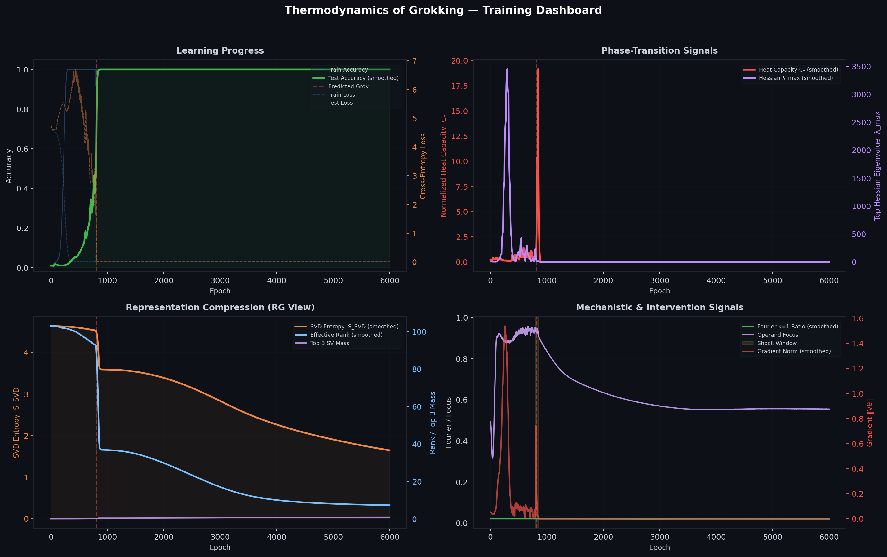
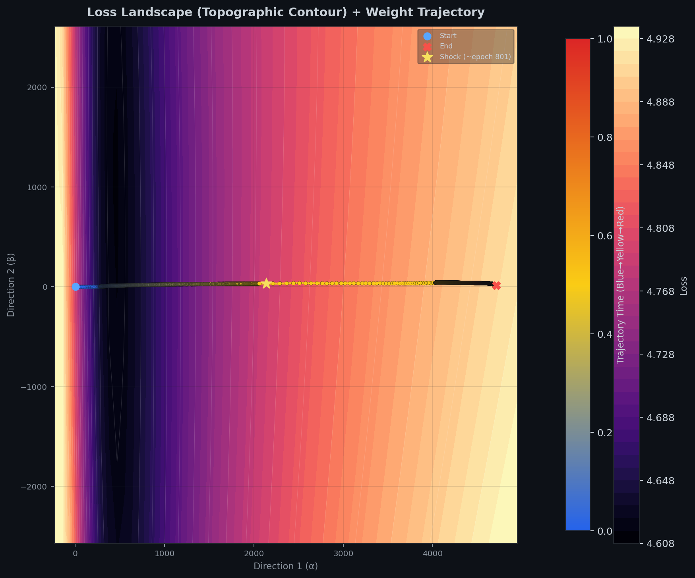
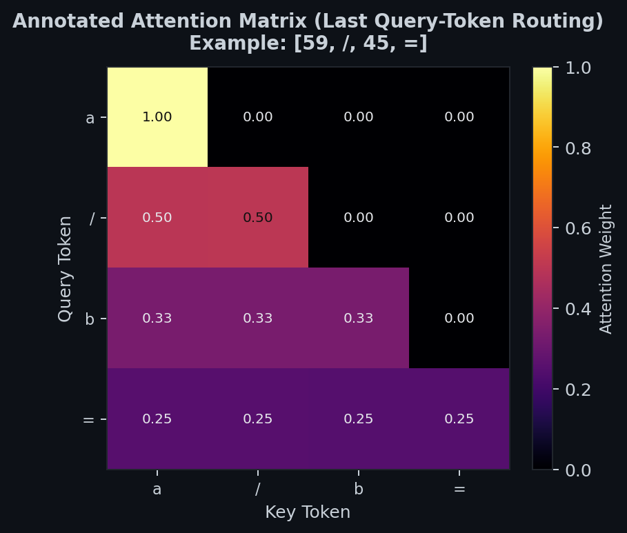
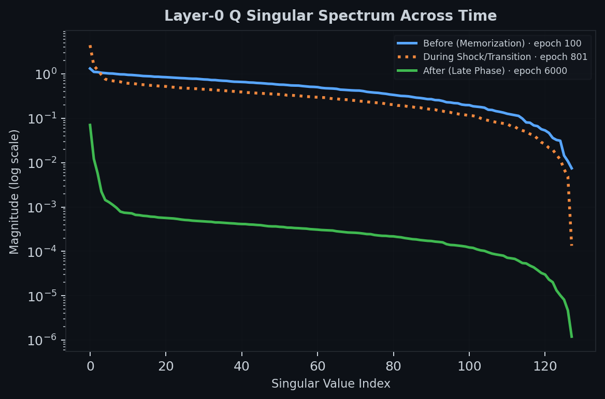

# Grokking from the perspective of Statistical Mechanics

Compact, instrumented experiments for studying grokking in tiny transformers with physics-inspired probes. By tracking the gradient variance (analogous to Heat Capacity, $C_v$), Renormalization Group (RG) flow via Effective Rank, and the top Hessian eigenvalue ($\lambda_{max}$), I empirically demonstrate that grokking is strictly bounded by a thermodynamic energy spike that flattens the local loss geometry. Furthermore, by artificially injecting thermal noise via batch-size annealing, we induce spontaneous rank collapse and force rapid generalization. Finally, mechanistic analysis of the internal representations reveals that for modular division, the model discards additive Fourier bases in favor of a sparse, high-dimensional (Rank-4) routing topology.

## Overview

- Trains a small decoder-only transformer on algorithmic tasks:
  - modular division (`a / b mod p`)
  - sparse parity
  - boolean logic circuits
- Track metrics and internal probes:
  - accuracy/loss/generalization gap
  - normalized heat-capacity proxy `C_v`
  - Hessian top eigenvalue (`lambda_max`)
  - SVD entropy / effective rank / top-3 mass
  - attention entropy and operand focus
  - Fourier low-frequency embedding metrics
- Supports controlled intervention windows (temporary small-batch phase).

## Results









## Code Structure

- `train_grokking.py`: backward-compatible CLI wrapper.
- `src/train.py`: training loop + CLI args.
- `src/data.py`: task generation and deterministic splits.
- `src/model.py`: transformer modules.
- `src/probes.py`: metrics/probes + phase prediction.
- `src/plotting.py`: dashboard and diagnostics.
- `src/runtime.py`: config parsing, device/W&B helpers, filesystem helpers.
- `configs/train_configs.yaml`: recommended long-run config.

## Setup

```powershell
uv sync
```

## Run Training

```powershell
uv run python .\train_grokking.py --config .\configs\train_configs.yaml
```

```powershell
uv run python .\train_grokking.py --config .\configs\train_configs.yaml --output-dir folder_name
```